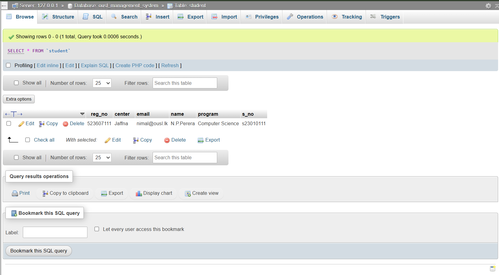

# 🏫 University Management System

[](https://www.oracle.com/java/)
[](https://maven.apache.org/)
[](https://hibernate.org/orm/)
[](https://www.mysql.com/)

## 📄 Description
A console-based **University Student Management System** built as a lab project (LAB04_523607238). Demonstrates full **CRUD operations** for student records using **Hibernate ORM** with **MySQL** database. Supports student registration, retrieval, updates, queries by center/program, and deletions.

## ✨ Features
- ✅ **Create**: Register new students with regNo, sNo, name, email, center, program
- ✅ **Read**: List all students, get by regNo, list by center
- ✅ **Update**: Modify student details (e.g., center)
- ✅ **Delete**: Remove student by sNo
- ✅ **Queries**: Count students by center or program
- 📊 JPA/Hibernate entity mapping and session management

## 🛠️ Tech Stack
| Technology | Version | Purpose |
|------------|---------|---------|
| Java | 17+ | Core language |
| Maven | 3.9+ | Build & dependency management |
| Hibernate ORM | 6.1.7.Final | JPA persistence |
| MySQL Connector | 8.0.32 | Database connectivity |
| Jakarta Persistence | - | Entity annotations |

## 📋 Prerequisites
- Java 17 or higher
- Maven 3.9+
- MySQL Server 8.0+ running locally/remote
- IDE: IntelliJ IDEA / Eclipse / VS Code with Java extensions (optional)

## 🚀 Quick Setup & Run

### 1. Clone the Repository
```bash
git clone https://github.com/yourusername/University-Management-System.git
cd University-Management-System
```

### 2. Database Setup
- Create MySQL database (e.g., `university_db`):
  ```sql
  CREATE DATABASE university_db;
  ```
- Update `src/main/resources/hibernate.cfg.xml` (if present) or properties in `HibernateUtil.java`:
  ```xml
  <property name="hibernate.connection.url">jdbc:mysql://localhost:3306/university_db</property>
  <property name="hibernate.connection.username">root</property>
  <property name="hibernate.connection.password">your_password</property>
  <property name="hibernate.hbm2ddl.auto">update</property>
  ```
  *(Hibernate auto-creates `student` table)*

### 3. Build & Run
```bash
# Clean and compile
mvn clean compile

# Run the main application
mvn exec:java -Dexec.mainClass="main.UniversityManagementApp"
```

### Expected Output
```
Students registered successfully

All Registered Students:
Student [regNo=523607111 sNo=s23010111 name=N.P.Perera email=nimal@ousl.lk center=Colombo program=Computer Science]
...

Final Student List:
...
```

## 📁 Project Structure
```
University-Management-System/
├── pom.xml                 # Maven config & dependencies
├── src/
│   ├── main/
│   │   ├── java/
│   │   │   ├── dao/        # StudentDao, IStudentDao
│   │   │   ├── main/       # UniversityManagementApp.java
│   │   │   ├── model/      # Student.java (JPA entity)
│   │   │   └── util/       # HibernateUtil.java
│   │   └── resources/      # hibernate.cfg.xml
├── target/                 # Compiled classes
└── README.md              # This file!
```

## 📸 Screenshots


## 📄 License
This project is for educational purposes - feel free to use/modify.

---

**Made by [Sanduni Fernando](https://github.com/sanduf01)**  
[Download CV](https://raw.githubusercontent.com/sanduf01/my-portfolio/main/portfolio/public/Sanduni%20Fernando%20CV.pdf) | [LinkedIn](https://linkedin.com/in/sanduf01)